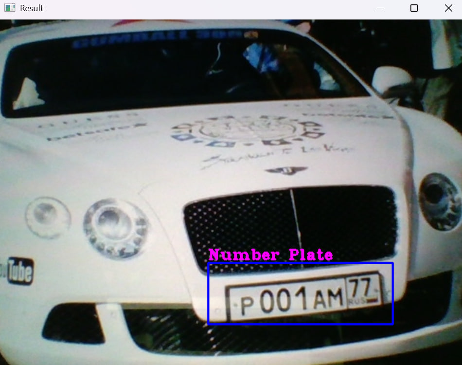

# License Plate Detection using OpenCV

## Overview
This project is a **real-time license plate detection system** powered by OpenCV and Haar cascades. It captures frames from a webcam, detects vehicle license plates, and allows users to **save detected plates as images with a single key press**. Whether you're working on an **automated security system or traffic monitoring**, this project provides a solid foundation for license plate recognition.

## How It Works
1. ** Video Capture** – The script initializes the webcam and continuously captures video frames.
2. ** Grayscale Conversion** – Frames are converted to grayscale to enhance detection accuracy.
3. ** License Plate Detection** – A Haar cascade classifier (`haarcascade_russian_plate_number.xml`) is used to detect plates.
4. ** Bounding Box Drawing** – A rectangle highlights the detected license plate for easy visualization.
5. ** Region of Interest (ROI) Extraction** – The detected license plate is cropped for further processing.
6. ** Save & Confirm** – Pressing 's' saves the extracted plate image and displays a confirmation message.

## Code Breakdown
- **Real-Time Processing**: The script reads frames, detects plates, and updates in real-time.
- **Optimized Detection**: Uses Haar cascades for efficient and accurate plate recognition.
- **User-Friendly Interaction**: Saves detected plates with a simple key press.
- **Customizable Parameters**: Adjust frame width, height, and detection area threshold as needed.

## Project Structure
```
📁 license-plate-detection/
│-- 📂 resources/
│   ├── 📜 haarcascade_russian_plate_number.xml  # Pre-trained model for plate detection
│   ├── 📂 scanned/  # Folder where detected plates are saved
│-- 📜 license_plate_detection.py  # Main script
│-- 📜 README.md  # Project documentation
```

## Example Images
Below are two example images showing the detection process:

### 📸 License Plate Detection in Action



